# 🍔 ByteBites Microservices Platform

ByteBites is a **cloud-native food delivery system** built using Spring Boot, Spring Cloud, Kafka, and JWT. The platform follows best practices for microservice architecture, focusing on scalability, resilience, security, and modularity.

---

## 📑 Table of Contents

- [Architecture Overview](#architecture-overview)
- [Prerequisites](#prerequisites)
- [Setup Instructions](#setup-instructions)
- [Configuration Management](#configuration-management)
- [Authentication & Authorization](#authentication--authorization)
- [Event-Driven Architecture](#event-driven-architecture)
- [Resilience with Resilience4j](#resilience-with-resilience4j)
- [Testing the Application](#testing-the-application)
- [API Documentation](#api-documentation)
- [Monitoring & Actuators](#monitoring--actuators)
- [Architecture Diagrams](#architecture-diagrams)
- [Troubleshooting](#troubleshooting)

---

## 🏗️ Architecture Overview

ByteBites is composed of the following services:

```
Client (Web/Mobile)
      |
API Gateway (Spring Cloud Gateway) — Validates JWT, routes requests
      |
Discovery Server (Eureka)
      |
-------------------------------------------------------------
|           |               |                |              |
Auth Service | Restaurant Service | Order Service | Notification Service
   (JWT/OAuth2)   |       (CRUD + Kafka)    |     (Kafka + Resilience) |  (Kafka + Email)
```

### 🔐 Security Flow

- Auth-service issues JWT tokens on login/registration
- API Gateway validates JWT and forwards user info to downstream services
- Role-Based Access Control (`@PreAuthorize`) is used inside services

---

---

## 🧭 Architecture Diagrams

### Security Flow


### JWT Token flow


### Kafka pub/sub flow


###  Overall microservices interaction


---

## ⚙️ Prerequisites

- Java 17+
- Maven 3.6+
- Docker & Docker Compose
- Git
- Postman (for API testing)

---

## 🚀 Setup Instructions

### 1. Clone the Repositories

```bash
git clone https://github.com/your-org/bytebites-microservices.git
cd bytebites-microservices
```

### 2. Start Infrastructure Services

```bash
# Start Kafka & Zookeeper
docker-compose -f docker/kafka-compose.yml up -d

# Start databases
docker-compose -f docker/db-compose.yml up -d
```

### 3. Create Config Repository

Create a second GitHub repo `bytebites-config-repo` and add config files:

#### `application.yml` (common/shared config):

```yaml
spring:
  cloud:
    config:
      uri: http://localhost:8888
jwt:
  secret: yourSecretKey
  expiration: 86400000 # 24 hours
```

#### `auth-service.yml` (per-service override):

```yaml
spring:
  datasource:
    url: jdbc:postgresql://localhost:5432/auth_db
    username: auth_user
    password: auth_pass
```

### 4. Start Config Server

Update `config-server/src/main/resources/application.yml`:

```yaml
spring:
  cloud:
    config:
      server:
        git:
          uri: https://github.com/your-org/bytebites-config-repo
          clone-on-start: true
```

Then run:

```bash
cd config-server
mvn spring-boot:run
```

### 5. Service Startup Order

```text
1. discovery-server
2. config-server
3. api-gateway
4. auth-service
5. restaurant-service
6. order-service
7. notification-service
```

Each service can be started via:

```bash
cd service-name
mvn spring-boot:run
```

---

## 🔐 Authentication & Authorization

- **JWT** tokens contain user info & roles.
- Validated at the **API Gateway**, passed as headers to other services.
- Role-Based Access (`@PreAuthorize`) restricts actions:
  - `ROLE_CUSTOMER`: Place/view orders
  - `ROLE_RESTAURANT_OWNER`: Manage their restaurant & menu
  - `ROLE_ADMIN`: Admin actions

### JWT Example

```json
{
  "sub": "customer@example.com",
  "userId": "12345",
  "roles": ["ROLE_CUSTOMER"],
  "iat": 1620000000,
  "exp": 1620086400
}
```

---

## 📡 Event-Driven Architecture

- Kafka used for decoupling services.
- `order-service` publishes `OrderPlacedEvent` to `orders-topic`.
- `notification-service` and `restaurant-service` consume that event.

### Example Flow:

1. `order-service` saves order.
2. Publishes `OrderPlacedEvent` to Kafka.
3. `notification-service` sends confirmation email.
4. `restaurant-service` begins order prep.

---

## 🛡️ Resilience with Resilience4j

### Configuration Example (`application.yml`):

```yaml
resilience4j:
  circuitbreaker:
    instances:
      restaurantService:
        slidingWindowSize: 10
        minimumNumberOfCalls: 5
        waitDurationInOpenState: 10s
        failureRateThreshold: 50
```

### Example Circuit Breaker Usage:

```java
@CircuitBreaker(name = "restaurantService", fallbackMethod = "restaurantFallback")
public CompletableFuture<Order> placeOrder(OrderRequest request) {
    restaurantServiceClient.validateOrderItems(request.getItems());
    return CompletableFuture.completedFuture(createOrder(request));
}
```

---

## 🧪 Testing the Application

### 1. Register User

```http
POST /auth/register
Content-Type: application/json

{
  "email": "user@example.com",
  "password": "securepass",
  "role": "ROLE_CUSTOMER"
}
```

### 2. Login and Get JWT

```http
POST /auth/login

{
  "email": "user@example.com",
  "password": "securepass"
}
```

### 3. Place Order

```http
POST /api/orders
Authorization: Bearer <JWT>
Content-Type: application/json

{
  "restaurantId": "1234",
  "items": [
    { "menuItemId": "1", "quantity": 2 },
    { "menuItemId": "2", "quantity": 1 }
  ]
}
```

---

## 📖 API Documentation

Each service exposes Swagger UI:

| Service            | Swagger URL                            |
|--------------------|-----------------------------------------|
| API Gateway        | http://localhost:8080/swagger-ui.html  |
| Auth Service       | http://localhost:8081/swagger-ui.html  |
| Restaurant Service | http://localhost:8083/swagger-ui.html  |
| Order Service      | http://localhost:8082/swagger-ui.html  |
| Notification       | http://localhost:8084/swagger-ui.html  |

---

## 📊 Monitoring & Actuators

Enable Spring Boot Actuator in each service:

### Common Actuator Endpoints:

| Endpoint                        | Description                        |
|----------------------------------|------------------------------------|
| `/actuator/health`              | Service health                     |
| `/actuator/circuitbreakers`     | Circuit breaker status             |
| `/actuator/metrics`             | Application metrics                |
| `/actuator/httptrace`           | HTTP request traces                |


## 🧰 Troubleshooting

| Problem                              | Solution                                                  |
|--------------------------------------|-----------------------------------------------------------|
| Eureka not registering services      | Check `eureka.client.service-url.defaultZone` in YML      |
| JWT token invalid                    | Check token secret and expiration                         |
| Kafka not delivering messages        | Confirm Kafka is up, check topic existence                |
| Circuit breaker not working          | Check `@CircuitBreaker` setup and actuator config         |
| Config server not loading values     | Check Git repo URL and YML names                          |
| Email not sending                    | Ensure correct SMTP config and credentials                |

---

## 📚 Additional Resources

- [Spring Cloud Documentation](https://spring.io/projects/spring-cloud)
- [Resilience4j Docs](https://resilience4j.readme.io)
- [JWT.io](https://jwt.io/)
- [Kafka Quickstart](https://kafka.apache.org/quickstart)
- [Micrometer](https://micrometer.io/)

---

## 📬 Contact

For support: [devops@bytebites.com](mailto:devops@bytebites.com)
